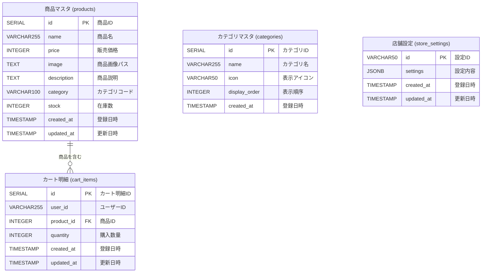

# データベース ER図

## テーブル構造

このドキュメントは、オフィスコンビニDX化アプリのデータベース構造を示すER図です。

## テーブル一覧（物理名・論理名）

| 物理名         | 論理名         | 説明                         |
| -------------- | -------------- | ---------------------------- |
| products       | 商品マスタ     | 販売する商品の情報を管理     |
| cart_items     | カート明細     | ユーザーのカート内商品を管理 |
| categories     | カテゴリマスタ | 商品カテゴリの情報を管理     |
| store_settings | 店舗設定       | 店舗の各種設定情報を管理     |

## ER図（Mermaid形式）



## テーブル詳細

### 1. products（商品マスタ）

販売する商品の情報を管理するマスタテーブル。

| 物理名      | 論理名         | データ型     | 制約                      | 説明                                                        |
| ----------- | -------------- | ------------ | ------------------------- | ----------------------------------------------------------- |
| id          | 商品ID         | SERIAL       | PRIMARY KEY               | 自動採番の主キー                                            |
| name        | 商品名         | VARCHAR(255) | NOT NULL                  | 商品の名称                                                  |
| price       | 販売価格       | INTEGER      | NOT NULL                  | 税込価格（円）                                              |
| image       | 商品画像パス   | TEXT         | -                         | 画像ファイルのパス（例: /images/products/onigiri-sake.jpg） |
| description | 商品説明       | TEXT         | -                         | 商品の詳細説明文                                            |
| category    | カテゴリコード | VARCHAR(100) | DEFAULT 'food'            | 所属カテゴリ                                                |
| stock       | 在庫数         | INTEGER      | DEFAULT 0                 | 現在の在庫数量                                              |
| created_at  | 登録日時       | TIMESTAMP    | DEFAULT CURRENT_TIMESTAMP | レコード作成日時                                            |
| updated_at  | 更新日時       | TIMESTAMP    | DEFAULT CURRENT_TIMESTAMP | レコード更新日時                                            |

**インデックス:**

- `idx_products_category` - カテゴリコード検索用
- `idx_products_name` - 商品名検索用

---

### 2. cart_items（カート明細）

ユーザーがカートに入れた商品の明細を管理するトランザクションテーブル。

| 物理名     | 論理名       | データ型     | 制約                        | 説明                   |
| ---------- | ------------ | ------------ | --------------------------- | ---------------------- |
| id         | カート明細ID | SERIAL       | PRIMARY KEY                 | 自動採番の主キー       |
| user_id    | ユーザーID   | VARCHAR(255) | NOT NULL, DEFAULT 'default' | カート所有者の識別子   |
| product_id | 商品ID       | INTEGER      | NOT NULL, FOREIGN KEY       | 商品マスタへの外部キー |
| quantity   | 購入数量     | INTEGER      | NOT NULL, DEFAULT 1         | カート内の商品数量     |
| created_at | 登録日時     | TIMESTAMP    | DEFAULT CURRENT_TIMESTAMP   | カート追加日時         |
| updated_at | 更新日時     | TIMESTAMP    | DEFAULT CURRENT_TIMESTAMP   | 数量変更日時           |

**制約:**

- `UNIQUE(user_id, product_id)` - 同一ユーザーの同一商品は1レコードで管理
- `FOREIGN KEY (product_id) REFERENCES products(id) ON DELETE CASCADE` -
  商品削除時に連動削除

**インデックス:**

- `idx_cart_items_user_id` - ユーザー別カート検索用

---

### 3. categories（カテゴリマスタ）

商品を分類するカテゴリ情報を管理するマスタテーブル。

| 物理名        | 論理名       | データ型     | 制約                      | 説明                     |
| ------------- | ------------ | ------------ | ------------------------- | ------------------------ |
| id            | カテゴリID   | SERIAL       | PRIMARY KEY               | 自動採番の主キー         |
| name          | カテゴリ名   | VARCHAR(255) | NOT NULL                  | カテゴリの表示名称       |
| icon          | 表示アイコン | VARCHAR(50)  | -                         | 絵文字アイコン（例: 🍱） |
| display_order | 表示順序     | INTEGER      | DEFAULT 0                 | 画面表示時の並び順       |
| created_at    | 登録日時     | TIMESTAMP    | DEFAULT CURRENT_TIMESTAMP | レコード作成日時         |

**インデックス:**

- `idx_categories_display_order` - 表示順ソート用

---

### 4. store_settings（店舗設定）

店舗全体の設定情報を管理する設定テーブル。

| 物理名     | 論理名   | データ型    | 制約                           | 説明                 |
| ---------- | -------- | ----------- | ------------------------------ | -------------------- |
| id         | 設定ID   | VARCHAR(50) | PRIMARY KEY, DEFAULT 'default' | 設定セットの識別子   |
| settings   | 設定内容 | JSONB       | NOT NULL, DEFAULT '{}'         | JSON形式の設定データ |
| created_at | 登録日時 | TIMESTAMP   | DEFAULT CURRENT_TIMESTAMP      | レコード作成日時     |
| updated_at | 更新日時 | TIMESTAMP   | DEFAULT CURRENT_TIMESTAMP      | 設定変更日時         |

**settingsカラムのJSON構造:**

```json
{
    "name": "店舗名",
    "description": "店舗説明",
    "businessHours": {
        "open": "09:00",
        "close": "18:00",
        "timezone": "Asia/Tokyo"
    },
    "taxRate": 0.1,
    "currency": "JPY",
    "features": {
        "cartEnabled": true,
        "darkModeEnabled": true,
        "categoriesEnabled": true,
        "stockDisplayEnabled": true
    },
    "theme": {
        "primaryColor": "#f97316",
        "accentColor": "#ea580c"
    }
}
```

---

## リレーションシップ

| 親テーブル | 子テーブル | 関係 | 説明                                      |
| ---------- | ---------- | ---- | ----------------------------------------- |
| products   | cart_items | 1:N  | 1つの商品は複数のカートアイテムに含まれる |

## 備考

- `categories`テーブルと`products`テーブルは現在、外部キー制約で紐づいていません（categoryカラムは文字列型）
- 将来的にカテゴリのリレーションを厳密に管理する場合は、`products.category`を外部キーに変更することを検討してください
